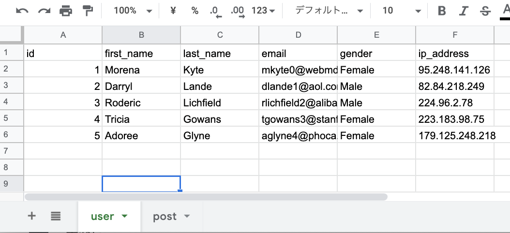

# gsql
It is for using Google Spreadsheet like SQL.

## How to Use
### Example SpreadSheet


### Code
```ts
const gsql = new GSQLManager(""/*{your spreadsheet id}*/);
const db = gsql.database;
const users = db.run(
  // ↓ SELECT first_name, email from user where id in (1, 2);
  select()
    .column('first_name', 'email') // first line is column name
    .from('user') //sheet name
    .where(inn('id', ['1', '2']))
    .query
);
users.forEach(user => {
  console.log(user['first_name'], user['email']);
});
// Morena mkyte0@webmd.com
// Darryl dlande1@aol.com
```


## ToDo
* [ ] Select
  * [x] WHERE A = 10
  * [x] WHERE A IN(10, 20)
  * [x] WHERE 1 = 1 AND 1 = 1
  * [x] WHERE 1 = 1 OR 1 = 1
  * [x] WHERE NOT 1 = 1
  * [ ] WHERE A <  10
  * [ ] WHERE A <= 10
  * [ ] WHERE A >  10
  * [ ] WHERE A >= 10
  * [ ] WHERE BETWEEN A AND B
  * [ ] WHERE Like
  * [ ] Join other table
* [ ] Insert
* [ ] Update
* [ ] Delete
